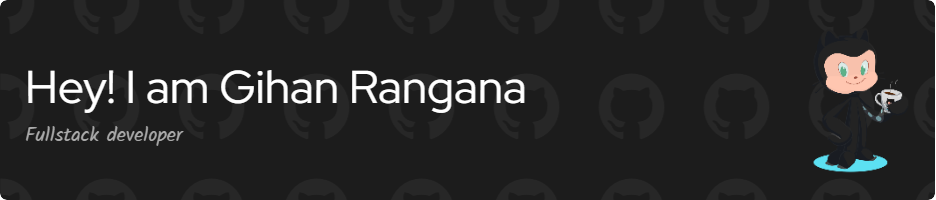

 

I’m excited to be in the deployment phase of my career as a full-time engineer, a problem solver who likes to face the challenges of my job. I am passionate and ambitious about my work and would love to be on a team that questions skills. I have been in my career as a full-time engineer for over five years

  
<h2>  Stats</h2>

 
 
 

..
